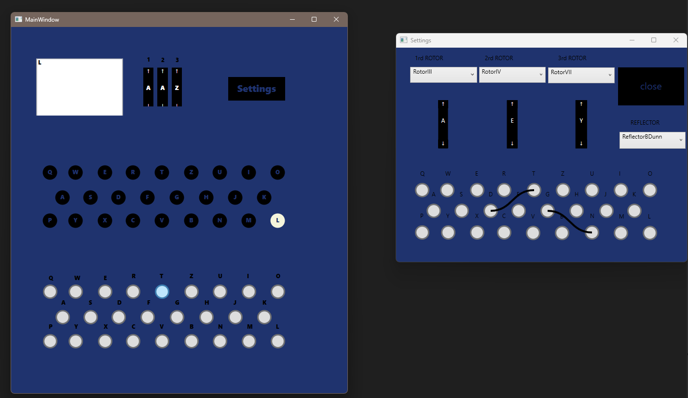
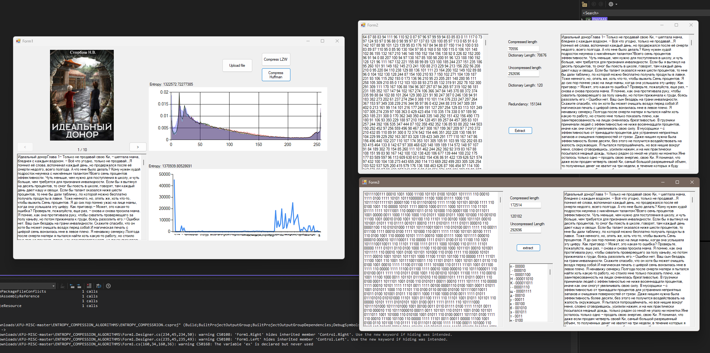

# Different algos related to information theory

### Made for university projects with C# and WPF or WinForms
***
## Projects
- Enigma machine with UI
- Entropy of images and compression the text from the .fb2 file
- Gradient descent with excel dataset example

## Examples
### Enigma 

### Compression & Entropy 
